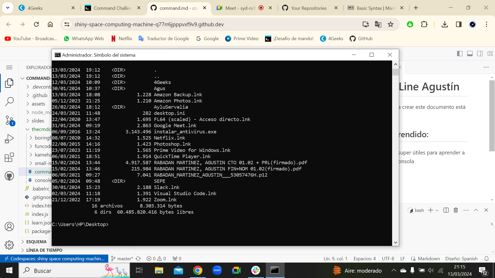

# Command Line Agustín

La documentación para crear este documento está **[AQUI](https://www.markdownguide.org/basic-syntax/)**

## Hoy hemos aprendido:

🌹 Muchos comandos super útiles para aprender a navegar utilizando la consola

**Esta consola es la que tiene mi sistema operativo (Windows)**, lo aprendido hoy está dentro de un contexto *Linux*. Ya que es el sistema operativo más accesible y con mas servidores FREE.

## Comandos mas importantes:
1. **pwd** (imprime el directorio donde te encuentras)
2. **clear** (limpia la consola)
3. **cd ..** (change directory)
4. **ls** (lista elementos del directorio)
5. 🔼 repite el ultimo comando introducido

## Otros comandos:
- mv: *mueve archivos*
- rm: *borra archivos*
- cp: *copia archivos*

